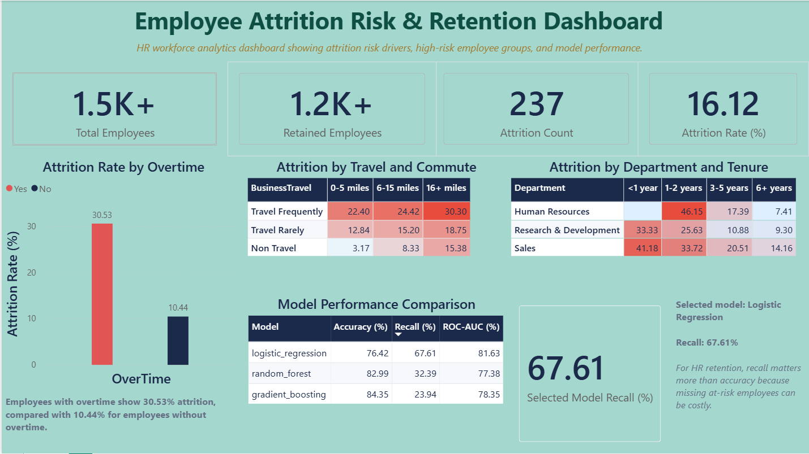

# Employee Attrition Risk & Retention Dashboard

## Project Overview

This project analyzes employee attrition risk using HR workforce data. The goal is to identify key attrition drivers, find high-risk employee groups, build machine learning models, and present actionable insights through a Power BI dashboard.

The project combines data science, R statistical analysis, SQL analysis, PySpark/Databricks ingestion, machine learning, and business intelligence reporting.

## Business Problem

Employee attrition can create high costs for organizations through hiring, training, productivity loss, and knowledge loss. HR teams need a way to understand which employee groups are more likely to leave and which factors contribute most to attrition.

This project focuses on answering:

- Which employee groups have higher attrition risk?
- How do overtime, business travel, commute distance, department, and tenure affect attrition?
- Which machine learning model is most useful for identifying at-risk employees?
- How can HR use the results to support retention decisions?

## Dataset

This project uses the [IBM HR Analytics Employee Attrition & Performance](https://www.kaggle.com/datasets/pavansubhasht/ibm-hr-analytics-attrition-dataset) dataset from Kaggle. It contains 1,470 employee records with 35 features covering demographics, job details, satisfaction scores, and attrition status.

## Tools & Technologies

- **Python**: data preprocessing and machine learning
- **Pandas / NumPy**: data manipulation
- **Scikit-learn**: model training and evaluation
- **SQL**: business question analysis
- **PySpark / Databricks**: data ingestion, modeling, and dashboard output pipeline
- **Power BI**: dashboard and data visualization
- **R Markdown**: exploratory analysis and report generation
- **Joblib**: model serialization

## Repository Structure

```text
employee-attrition-prediction/
│
├── data/
│   └── HR_Employee_Attrition.csv
│
├── databricks/
│   ├── 01_data_ingestion.ipynb
│   ├── 02_modeling.ipynb
│   └── 03_dashboard_outputs.ipynb
│
├── docs/
│   ├── LucNguyen_Final_Project.pdf
│   └── LucNguyen_FinalProject.html
│
├── models/
│   ├── attrition_pipeline.joblib
│   └── model_metrics.csv
│
├── powerbi/
│   ├── data/
│   └── screenshots/
│       └── dashboard_emp.png
│
├── sql/
│   ├── attrition_business_questions.sql
│   └── create_attrition_table.sql
│
├── src/
│   ├── attrition_model.py
│   └── employee_attrition_analysis.Rmd
│
├── .gitignore
├── README.md
└── requirements.txt
```

## Project Workflow

### 1. Data Ingestion (Databricks)

The project includes a 3-notebook Databricks pipeline using PySpark:

1. **`01_data_ingestion.ipynb`** — Loads the dataset into a Spark DataFrame, runs data quality checks (duplicates, nulls, invalid values), performs SQL-based EDA, and saves a reusable Databricks table.
2. **`02_modeling.ipynb`** — Reads the ingested table, trains three classification models (Logistic Regression, Random Forest, Gradient Boosting), evaluates performance with recall priority, and saves model metrics as a Databricks table.
3. **`03_dashboard_outputs.ipynb`** — Reads the employee and model metrics tables, creates five dashboard-ready summary tables (overview, overtime, tenure, travel, model comparison), and saves them for Power BI.

### 2. Data Cleaning & Preparation

The dataset was prepared for analysis and modeling by handling categorical variables, separating features and target labels, and preparing the data for machine learning pipelines.

### 3. Exploratory Data Analysis

EDA was performed to understand patterns in employee attrition across different workforce dimensions, including:

- Overtime
- Business travel
- Commute distance
- Department
- Tenure
- Employee demographics and job-related features

### 4. SQL Business Analysis

SQL queries were created to answer business-focused HR questions, such as attrition rate by department, tenure group, travel frequency, and other employee segments.

### 5. Machine Learning Modeling

Multiple classification models were trained and compared to predict employee attrition risk.

Models tested:

- Logistic Regression
- Random Forest
- Gradient Boosting

### 6. Model Evaluation

The models were evaluated using accuracy, recall, and ROC-AUC.

| Model               | Accuracy | Recall | ROC-AUC |
| ------------------- | -------: | -----: | ------: |
| Logistic Regression |   76.42% | 67.61% |  81.63% |
| Random Forest       |   82.99% | 32.39% |  77.38% |
| Gradient Boosting   |   84.35% | 23.94% |  78.35% |

> **Note:** The table above reports Databricks pipeline metrics. Local Python results (in `models/model_metrics.csv`) may differ slightly due to library and runtime differences across environments. Logistic Regression remains the selected model in both cases as it achieves the highest attrition recall.

## Selected Model

**Logistic Regression** was selected as the final model.

Although Random Forest and Gradient Boosting achieved higher accuracy, Logistic Regression had the highest recall. For an HR attrition use case, recall is more important because missing at-risk employees can be costly.

In this business context:

- A false negative means the model fails to identify an employee who may leave.
- HR may lose the opportunity to take retention action.
- Therefore, identifying more potential attrition cases is more valuable than optimizing accuracy alone.

Note that prioritizing recall comes with a tradeoff: the model's attrition precision is approximately 37%. This means some employees flagged as high-risk will not actually leave. Because of this, the model should be used as a decision-support tool for HR review, not as an automated decision system.

## Key Insights

- Employees who work overtime show significantly higher attrition risk.
- Frequent business travel combined with longer commute distance is associated with higher attrition.
- Attrition risk varies by department and tenure group.
- Some employee groups show higher risk early in their tenure.
- Recall is the most important model metric for this use case because HR needs to detect as many at-risk employees as possible.

## Power BI Dashboard

The Power BI dashboard summarizes attrition risk patterns, high-risk employee groups, and model performance.



The dashboard includes:

- Total employees
- Retained employees
- Attrition count
- Attrition rate
- Attrition by overtime
- Attrition by business travel and commute distance
- Attrition by department and tenure
- Model performance comparison
- Selected model recall

## Business Recommendations

Based on the analysis, HR teams should consider:

1. **Monitoring overtime workload**
   Employees with overtime show higher attrition risk. HR and managers should review workload balance and burnout risk.

2. **Supporting frequent travelers**
   Employees who travel frequently, especially with longer commutes, may need additional flexibility or support.

3. **Focusing on early-tenure employees**
   Some attrition risk appears within early tenure groups. Better onboarding, career development, and manager check-ins may help reduce early attrition.

4. **Using recall-focused models for retention**
   In employee attrition prediction, it is better to identify more potentially at-risk employees than to miss them.

## Prerequisites

- **Python 3.10+**
- **R 4.0+** and RStudio (for the R Markdown analysis)
- **Power BI Desktop** (to open `powerbi/data/dashboard_emp.pbix` included in this repository)
- **Databricks workspace** (optional, to run the PySpark notebooks)

## How to Run the Project

### Python (model training)

#### 1. Clone the repository

```bash
git clone https://github.com/luc-dt/employee-attrition-prediction.git
cd employee-attrition-prediction
```

#### 2. Create a virtual environment

```bash
python -m venv .venv
```

#### 3. Activate the virtual environment

Windows:

```bash
.venv\Scripts\activate
```

Mac/Linux:

```bash
source .venv/bin/activate
```

#### 4. Install dependencies

```bash
pip install -r requirements.txt
```

#### 5. Run the model training script

```bash
python src/attrition_model.py --data data/HR_Employee_Attrition.csv
```

The `--data` flag is optional. The script defaults to `data/HR_Employee_Attrition.csv` when run from the repository root.

### R Markdown (exploratory analysis)

#### 1. Install required R packages

```r
install.packages(c("tidyverse", "corrplot", "factoextra", "caret",
                   "MASS", "class", "randomForest", "gbm", "pROC"))
```

#### 2. Open and knit the analysis

Open `src/employee_attrition_analysis.Rmd` in RStudio and click **Knit** to generate the HTML or PDF report.

### Databricks (PySpark pipeline)

Import the three notebooks from `databricks/` into a Databricks workspace and run them in order:

1. `01_data_ingestion.ipynb`
2. `02_modeling.ipynb`
3. `03_dashboard_outputs.ipynb`

## Outputs

The project produces the following outputs:

- Trained machine learning pipeline: `models/attrition_pipeline.joblib`
- Model performance results: `models/model_metrics.csv`
- SQL business analysis queries: `sql/`
- Power BI dashboard screenshot: `powerbi/screenshots/dashboard_emp.png`
- Final analysis report: `docs/`
- Databricks tables: `attrition_project.employee_attrition`, `attrition_project.model_metrics`, and five `dashboard_*` tables

## Limitations

- The dataset is a synthetic public IBM HR dataset and may not reflect real workforce dynamics at any specific company.
- Model performance may not generalize to organizations with different cultures, industries, or HR practices.
- The model was trained on a single 70/30 split without cross-validation, which may introduce variance in reported metrics.
- Attrition prediction should support, not replace, human HR judgment and should be reviewed alongside qualitative context.
- Additional validation, fairness review, and legal compliance checks would be required before any production deployment.

## Skills Demonstrated

This project demonstrates:

- Data cleaning and preprocessing
- Exploratory data analysis
- SQL-based business analysis
- Classification modeling
- Model evaluation and selection
- Recall-focused business reasoning
- PySpark DataFrame API and Databricks SQL
- End-to-end Databricks notebook pipeline
- Power BI dashboard development
- Communicating technical results to business users

## Future Improvements

Possible next steps include:

- Add feature importance analysis
- Tune model thresholds to improve recall
- Add cross-validation
- Build an interactive Power BI report file
- Add employee risk scoring output
- Deploy the model as a simple API or batch scoring pipeline

## Conclusion

This project shows how data science can support HR decision-making by identifying attrition risk patterns and helping HR teams focus on employees who may need retention support. The final model and dashboard are designed to turn workforce data into practical business insights.
